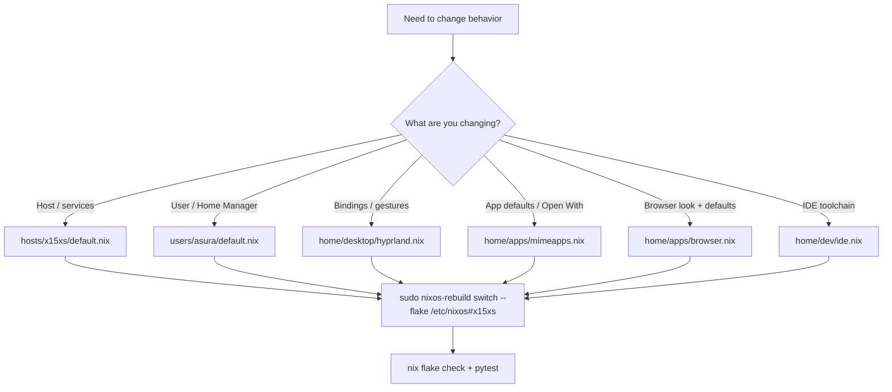

# X15 XS NixOS Flake

[](https://github.com/Valo-Asura/nixosEnd4/actions/workflows/ci.yml)
[](https://github.com/Valo-Asura/nixosEnd4/actions/workflows/markdown.yml)

NixOS unstable on `x15xs`, using `Hyprland 0.54` with end-4's Illogical Impulse shell via `github:soymou/illogical-flake`.

## Start Here (New User)

If you are new to this repo, use this quick loop:

1. Change config in Nix files (not random dotfiles in `$HOME`).
2. Rebuild with `sudo nixos-rebuild switch --flake /etc/nixos#x15xs`.
3. If anything looks wrong, run validation commands and check docs below.

## At A Glance

- Compositor/Shell: `Hyprland 0.54` + Illogical Impulse / QuickShell
- Theme: `adw-gtk3-dark` + `kvantum-dark` + `Bibata-Modern-Classic 24`
- Color pipeline: `matugen image <wallpaper> --mode dark --source-color-index 0`
- Portals: `xdg-desktop-portal-hyprland` only
- Display: explicit `eDP-1 = 1920x1080@144`
- Perf defaults: QuickShell-only blur, static workspace wallpaper, `QSG_RENDER_LOOP=basic`, `zramSwap.enable=true`, battery-care target `90%` on supported backends

## Visual Map



## Inputs

- `illogical-flake = github:soymou/illogical-flake`
- `hyprland = github:hyprwm/Hyprland/v0.54.0`
- `quickshell = git+https://git.outfoxxed.me/quickshell/quickshell`
- `matugen = github:InioX/matugen`

Update one input at a time:

```bash
nix flake update hyprland
nix flake update quickshell
nix flake update matugen
```

No runtime `git clone` is used.

## Source Of Truth

- [flake.nix](./flake.nix): inputs and overlays
- [hosts/x15xs/default.nix](./hosts/x15xs/default.nix): host config entrypoint
- [users/asura/default.nix](./users/asura/default.nix): Home Manager entrypoint
- [configuration.nix](./configuration.nix): compatibility shim to the host folder entrypoint
- [modules/battery-care.nix](./modules/battery-care.nix): persistent battery-care helper and QuickShell-facing charge-limit backend
- [home/core/packages.nix](./home/core/packages.nix): shared CLI, media, and desktop package set
- [home/apps/](./home/apps): browser, MIME/default-app ownership, and Yazi
- [home/dev/](./home/dev): Git, IDE, and Nanobot development tooling
- [home/desktop/hyprland.nix](./home/desktop/hyprland.nix): layout, bindings, and perf-sensitive Hyprland overrides
- [home/desktop/end4/module.nix](./home/desktop/end4/module.nix): local wrapper around `illogical-flake`
- [home/desktop/end4/settings.nix](./home/desktop/end4/settings.nix): end-4 settings, writable theme outputs, and dark-mode bootstrap
- [home/desktop/end4/overrides/Todo.qml](./home/desktop/end4/overrides/Todo.qml): local QuickShell todo override with safer JSON loading and persistence
- [HYPRLAND_CONTROLS.md](./HYPRLAND_CONTROLS.md): local control map for navigation, resize mode, and workspace travel
- [END4_SETTINGS.md](./END4_SETTINGS.md): end-4 / QuickShell settings reference

## Core Values

- Declarative first: all critical behavior should be encoded in Nix and survive rebuilds.
- Single owner per concern: avoid split ownership for bindings, MIME, theming, and launcher behavior.
- Stable dark contract: GTK `adw-gtk3-dark`, Qt `kvantum-dark`, and wallpaper-driven Matugen colors remain aligned.
- Practical performance: prefer lower-latency, low-overhead defaults that keep Hyprland sessions responsive.
- Reproducible debugging: pair every meaningful config change with docs and structural tests.

## Essential Defaults

Persistent end-4 defaults are merged into `~/.config/illogical-impulse/config.json` from [home/desktop/end4/settings.nix](./home/desktop/end4/settings.nix). Use that file for values you want to survive rebuilds.

| Setting | Value |
| --- | --- |
| UI language | `language.ui = "en_US"` |
| Calendar locale | `calendar.locale = "en-GB"` |
| Clock format | `time.format = "hh:mm AP"` |
| Pomodoro focus | `time.pomodoro.focus = 2700` (`45m`) |
| Weather city | auto-synced from current public IP geolocation (`ipapi.co`) at Home Manager activation, fallback `Rishikesh, Uttarakhand, India 249204` |
| Sidebar loading | `sidebar.keepRightSidebarLoaded = false` |
| Wallpaper parallax | `background.parallax.enableWorkspace = false` |
| Shell resource polling | `resources.updateInterval = 10000` |
| Lock provider | `lock.useHyprlock = false` |
| Lock blur | `lock.blur.radius = 64` |
| Battery care | bar charge-limit button shown by default, restore `90%` limit on supported backends |

QuickShell state is bootstrapped declaratively in `~/.local/state/quickshell/user`, including `todo.json` and `notes.txt`.

Wallpapers below `1920x1080` are replaced with the bundled `3840x2160` default during Home Manager activation.

Mutable generated outputs are copied or linked into:

- `~/.config/matugen`
- `~/.config/fuzzel`
- `~/.config/hypr/hyprland/colors.conf`
- `~/.config/hypr/custom/scripts`
- `~/.config/gtk-4.0/gtk.css`

## Apps

- Browsers: Firefox ships as the themed primary browser, Google Chrome is available for Chromium compatibility, and Zen Browser stays installed as an alternate browser.
- Web defaults: Firefox is the default web handler for `http`, `https`, and `text/html`.
- Media: VLC is installed declaratively and seeded as the default handler for common audio and video formats.
- IDEs: VS Code, Cursor, Kiro, and Antigravity come from the pinned unstable input set through Nixpkgs and are tuned by [home/dev/ide.nix](./home/dev/ide.nix).
- IDE extensions: the shared stack now includes Python, Pylance, Black, isort, Ruff, Jupyter helpers, YAML, Docker, and Rust/Nix tooling across VS Code, Cursor, Kiro, and Antigravity.
- Notebook runtime: IDE notebooks now default to a declarative local Python interpreter that includes `black`, `debugpy`, `flake8`, `isort`, `ipykernel`, `jupyterlab`, `mypy`, `pylint`, `ruff`, and `pip` (via [home/dev/ide.nix](./home/dev/ide.nix)).
- Python/DS tooling: `python3`, `conda` (Anaconda-compatible workflow), `jupyterlab`, and `uv` are installed declaratively via [home/core/packages.nix](./home/core/packages.nix).
- AI tooling: `claude-code` (CLI agent) and `ollama` (CLI client) are installed declaratively; the local Ollama CUDA service remains managed by [modules/ollama.nix](./modules/ollama.nix), with Open WebUI disabled by default to keep idle memory lower.
- GUI file managers: Nemo is kept as the single primary GUI file manager; redundant `nautilus` and `thunar` installs were removed.
- Nix maintenance: Limine natively shows only the latest `7` system generations, weekly garbage collection deletes paths older than `7d`, and store optimization stays enabled.
- Boot layout: the active Limine ESP is `nvme0n1p1` (`BB34-5262`), while the Windows EFI files live on `nvme1n1p1` (`D85E-0D8D`) and are targeted by GUID from Limine.

## Key Bindings Quick Reference

| Action | Binding |
| --- | --- |
| Open launcher | `tap/release Super` |
| Lock screen | `Super+L` or `Ctrl+L` (QuickShell) |
| Resize mode | `Super+Tab` or `Super+Shift+R` |
| Workspace overview | `Super+Shift+Tab` |
| Open wallpaper selector | `Super+P` |
| Random wallpaper | `Super+Shift+P` |
| File manager | `Super+F` (Nemo) |
| Browser | `Super+B` (Firefox) |
| Toggle floating | `Super+V` |
| Toggle split | `Super+J` (toggle the current dwindle split) |
| Move focus | `Super+Left/Right/Up/Down` |
| Move window | `Super+Shift+Left/Right/Up/Down` |
| Mouse move | `Super+LMB` |
| Mouse resize | `Super+RMB` |
| Touchpad move | `Super+Ctrl` + touchpad drag |
| Touchpad resize | `Super+Alt` + touchpad drag |
| Workspace gesture | `3-finger horizontal swipe` |

## Behavior Notes

- Hyprland uses `general.layout = dwindle` with `dwindle.preserve_split = true` and `dwindle.precise_mouse_move = true`.
- The local module overrides `hypr/hyprland/keybinds.conf` directly to prevent upstream End-4 collisions.
- The local module owns `hypr/hypridle.conf` too, and idle/suspend locking is routed to QuickShell instead of Hyprlock.
- `custom/keybinds.conf` is intentionally empty to keep one declarative binding source.
- Resize mode returns cleanly to the global submap.
- `hypr/monitors.conf` pins the internal panel to `1920x1080@144`.
- [home/apps/mimeapps.nix](./home/apps/mimeapps.nix) keeps MIME defaults declarative and writes `mimeapps.list` as regular files so right-click `Open With` persists.

## Daily Workflow

```bash
sudo nixos-rebuild switch --flake /etc/nixos#x15xs
nix flake check . --no-build --option abort-on-warn true
nix-shell -p python3 python3Packages.pytest python3Packages.hypothesis --run "pytest tests/test_migration.py -q"
nix build .#nixosConfigurations.x15xs.config.system.build.toplevel --no-link
```

## GitHub Workflows

- CI: [`.github/workflows/ci.yml`](./.github/workflows/ci.yml)
- Markdown lint: [`.github/workflows/markdown.yml`](./.github/workflows/markdown.yml)
- Contribution guide: [`CONTRIBUTING.md`](./CONTRIBUTING.md)

## Credits

- end-4 and the original `dots-hyprland`/Illogical Impulse vision and UX direction.
- soymou for [`illogical-flake`](https://github.com/soymou/illogical-flake), which this repo layers on top.
- Hyprland team for [`Hyprland`](https://github.com/hyprwm/Hyprland).
- outfoxxed + contributors for [`QuickShell`](https://git.outfoxxed.me/quickshell/quickshell).
- InioX for [`matugen`](https://github.com/InioX/matugen).
- Firefox, Google Chrome, and Zen Browser projects for the browser experience this config tunes.
